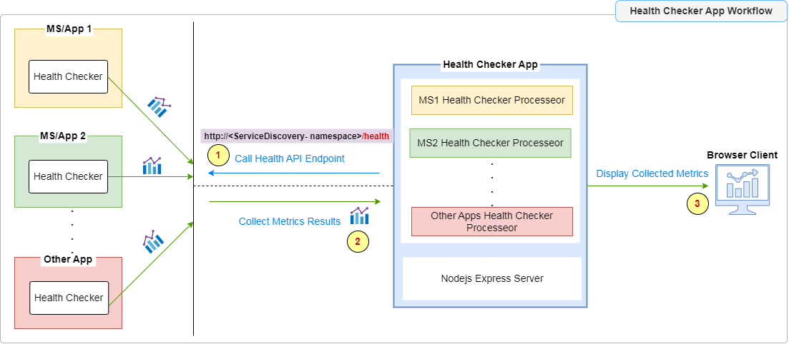
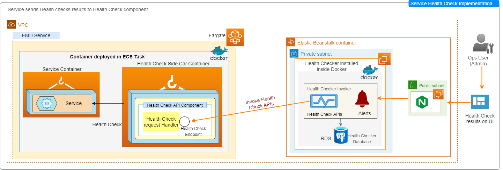

# Microservices-HealthChecker

Health Monitoring tool to monitor microservices/apps

## Contents
1. [Overview](#overview)
2. [Tech Stack](#tech-stack)
3. [Prerequisites](#prerequisites)
4. [Installation](#installation)
     - [Local Environment](#local-environment)
     - [Docker Environment](#docker-environment)
5. [Launching Application](#launching-application)
     - [In Local Environment](#in-local-environment)
     - [In Docker Environment](#in-docker-environment)
6. [Accessing Application](#accessing-application)
7. [Application Architecture Workflow](#application-architecture-workflow)


## Overview

This application is used as a Health Monitoring tool to monitor any microservice/application. This application works isolately from other core apps. 

This app communicates with core target apps to collect health data. Each core app has 'health checker' component implemented internally that generates various metrices to help in measuring app health. This internal 'health checker' component is called by the REST API Endpoint.

Health Monitoring app calls each target app via REST API Endpoint (*configurable*) to gather all metric data and process them to generate informational results in categorised format. Each metrics has threshold set to determine if the relevant part of the app is working as expected or require further action.

Once all results are processed, user can view the results in Graphical interface.

## Application Architecture Workflow



## Deployment Architecture




**Endpoints**

- `/msHC` *TG Health Checkpoint* - Internal app's health check point `/msHC` which is used by AWS Load balancer or ElasticBeanstalk to check the app's health and to handle 404 error

- `/health` *To View Health Check Results* - All Health Check results collected from the apps are displayed in Graphical Interface by using this path


## Tech Stack

- Node.js (Express)

- TypeScript

- Docker

- AWS


## Prerequisites

 1. Node.js & npm ^v18.x already installed (For Local env)
 
 2. Docker and Docker Compose already installed (For Dev env)
 
 
## Installation

### Local Environment

For Development and Testing application on local terminal.

1. Set essential Configuration properties (like target app's Health Endpoint Settings) in the following file to set in ENV VARs locally:

     - `envs/.env.local`

2. From the terminal, run:

    ```bash
    $ cd healthchecker
    $ npm install
    ```
   
   This will install NPM modules locally in the project folder. 


### Docker Environment

#### Prerequisites:

1. Docker Installed

2. Port 1400 (default) for App is free and not in use

3. Database already created

#### Setup

1. Set essential Configuration properties (like AWS Profile Details) in the following file:

     - `docker/awsbuild/.conf`

2. From the terminal, run following commands:

    ```bash
    $ cd healthchecker/docker/awsbuild
    $ chmod -R 777 *.sh
    $ ./launch.sh
    ```

It will setup Health Checker app inside Docker container.


## Launching Application

### In Local Environment

Auth app supports multiple modes: development, and production

**Development Mode**

```bash
$ npm run start:dev
```

**Production Mode**

```bash
$ export APP_ENV=prod
$ npm run build
$ npm run start:prod
```


### In Docker Environment

> Health Checker app server runs inside docker containers

Just ensure that Docker containers are up in the host machine by using `docker ps` command.
There will be a container running namely: `healthCheckerApp_aws`


## Accessing Application

Application can be accessed in the browser by using the URL:

http://localhost:1400/health


